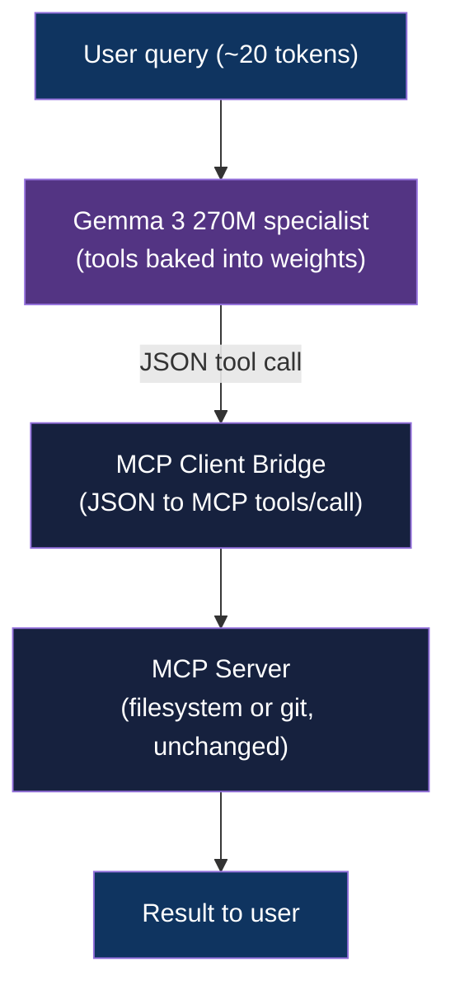
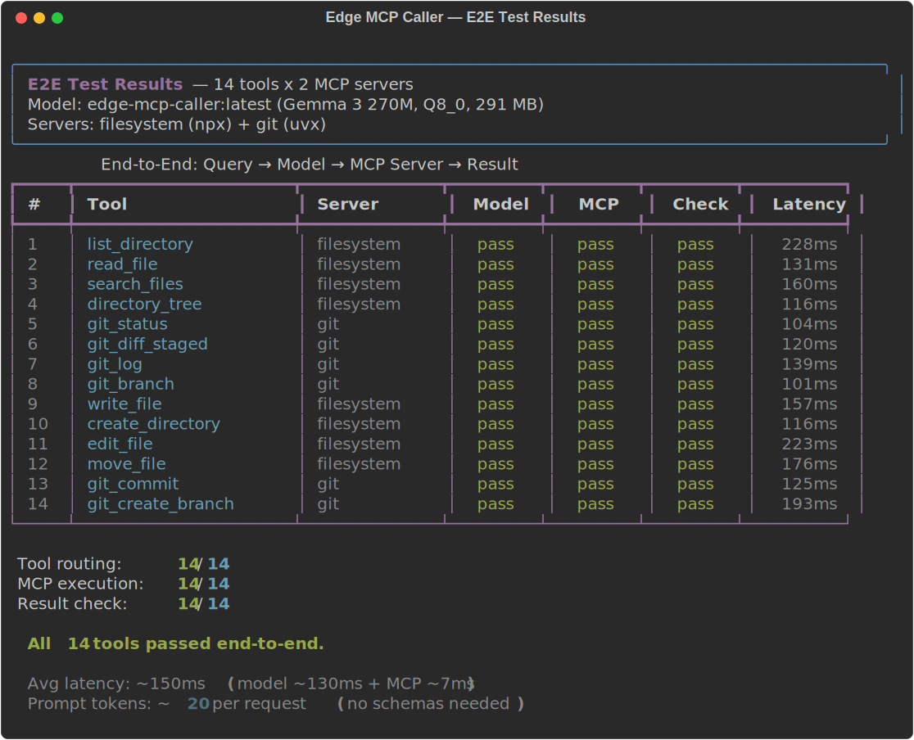

<div align="center">

# Edge MCP Caller: 270M Tool-Calling Specialist

[](https://www.python.org/downloads/)
[](LICENSE)

**270M specialist that bakes MCP tool knowledge into weights: 99.5% accuracy across 14 tools, 32x fewer prompt tokens**

[Getting Started](#getting-started) | [Architecture](#architecture) | [Results](#results) | [Demo](#demo)

</div>

---

## Table of Contents

- [The Problem](#the-problem)
- [Features](#features)
- [Tech Stack](#tech-stack)
- [Architecture](#architecture)
- [Demo](#demo)
- [Getting Started](#getting-started)
  - [Prerequisites](#prerequisites)
  - [Installation](#installation)
- [Usage](#usage)
- [API Reference](#api-reference)
- [Results](#results)
- [Data Engineering](#data-engineering)
- [Architectural Decisions](#architectural-decisions)
- [Project Structure](#project-structure)
- [Testing](#testing)
- [License](#license)
- [Author](#author)

## The Problem

### Generalist vs specialist tool calling

Google's FunctionGemma takes Gemma 3 270M and makes it a generalist function caller: pass any tool schema in the prompt, and it routes to the right tool. Every request carries the full schema set, so prompt token cost scales linearly with tool count and a tiny model spends its parameters parsing schemas instead of resolving intent.

### The Solution

This project takes the same base model and makes it a specialist. Tool definitions are baked directly into model weights, so no schemas appear in the prompt. A query goes in (about 20 tokens) and a JSON tool call comes out, regardless of how many tools the model knows.

> A 270M model has no business being a generalist. Make it a specialist, deploy it on the edge, and let it do one job perfectly.

## Features

- **14 tools, 2 MCP servers**: filesystem (8 tools) plus git (6 tools)
- **99.5% combined accuracy**: 12 of 14 tools at 100%, no degradation from 3 to 14 tools
- **32x fewer tokens**: 20 tokens vs 647+ per request, because schemas live in the weights
- **Edge-ready**: 291 MB Q8_0, runs on phones, laptops, Raspberry Pi
- **153ms average latency**: fully local, no cloud dependency, zero API cost
- **MCP-native**: calls real MCP servers over the standard protocol

## Tech Stack

| Component | Technology |
|-----------|------------|
| Base Model | Gemma 3 270M (`unsloth/gemma-3-270m-it`) |
| Fine-tuning | Unsloth (LoRA r=128, BF16) |
| Training Data | Claude Code agents (Sonnet 4.6), extraction-only rules |
| Inference | Ollama (Q8_0 GGUF, 291 MB) |
| MCP Servers | @modelcontextprotocol/server-filesystem (npx), mcp-server-git (uvx) |
| Language | Python 3.12+ |
| Hardware | RTX 4060 Laptop (8GB VRAM), single consumer GPU |

## Architecture



The specialist routes intent and extracts arguments, then the bridge translates its JSON into standard MCP `tools/call` requests. The token budget is the structural difference from generalist callers:

```text
Generalist (FunctionGemma / GPT-OSS):
  Input:  [~600 tokens of schemas] + [query]  = ~650 tokens
  Model:  params split between parsing schemas and routing intent

Specialist (ours):
  Input:  [query only]  = ~20 tokens
  Model:  params fully focused on routing intent for known tools
  Output: {"tool": "list_directory", "args": {"path": "src/"}}
```

## Demo

Full end-to-end run: natural language query to 270M model to MCP server to real result. All 14 tools pass.




Per-tool casts and GIFs for all 14 tools live in [`demos/per-tool/`](demos/per-tool/).

## Getting Started

### Prerequisites

- Python 3.12+
- NVIDIA GPU with 8GB+ VRAM for training, or free Google Colab
- Ollama for inference
- Node.js 18+ for the filesystem MCP server
- uv / uvx for the git MCP server

### Installation

```bash
git clone https://github.com/adityonugrohoid/edge-mcp-caller.git
cd edge-mcp-caller
python -m venv .venv
source .venv/bin/activate
pip install -r requirements.txt
cp .env.example .env
```

## Usage

```bash
# Step 1: Generate training data with Claude Code agents into data/generated/,
#         then merge: python data/merge_dataset.py

# Step 2: Fine-tune (LoRA on Gemma 3 270M)
python train/finetune.py

# Step 3: Merge adapter and convert to GGUF for Ollama
python train/merge_and_convert.py

# Step 4: Benchmark (scaling curve across 4 models)
python eval/benchmark.py                    # 14-tool, 30/tool
python eval/benchmark.py --subset 3         # 3-tool subset
python eval/benchmark.py --subset all       # full scaling curve

# Step 5: Interactive demo (query to model to MCP servers to result)
python demo/cli.py                          # interactive, auto-detect git
python demo/cli.py /path/to/dir             # specify allowed directory
python demo/cli.py --repo /path/to/repo     # explicit git repo path
python demo/cli.py --no-git                 # filesystem only
python demo/cli.py -n 10                    # batch mode
python demo/cli.py -n 5 --verbose           # batch with detail
```

## API Reference

The model's callable surface is 14 MCP tools across two servers. The bridge (`mcp/client.py`) routes each JSON tool call to the matching server.

### Filesystem MCP Server (8 tools)

| Tool | Args |
|------|------|
| `list_directory` | `path` |
| `read_file` | `path` |
| `search_files` | `path`, `pattern` |
| `write_file` | `path`, `content` |
| `create_directory` | `path` |
| `edit_file` | `path`, `old_text`, `new_text` |
| `move_file` | `source`, `destination` |
| `directory_tree` | `path` |

### Git MCP Server (6 tools)

| Tool | Args |
|------|------|
| `git_status` | _(none)_ |
| `git_diff_staged` | _(none)_ |
| `git_commit` | `message` |
| `git_log` | `max_count` _(optional)_ |
| `git_branch` | _(none)_ |
| `git_create_branch` | `branch_name`, `base_branch` _(optional)_ |

## Results

420 eval examples across 14 tools, deterministic (temp=0), each model tested in its native interface.

| Model | Size | Tool Routing | Combined | Prompt Tokens | Latency |
|-------|------|-------------|----------|---------------|---------|
| **Ours (specialist)** | **270M** | **99.8%** | **99.5%** | **20** | **153ms** |
| GPT-OSS 120B (NIM API) | 120B | 72.6% | 41.7% | 647 | 1,111ms |
| FunctionGemma (Ollama tools API) | 270M | 21.4% | 13.6% | 967 | 235ms |
| Raw Gemma 3 (few-shot prompt) | 270M | 33.3% | 11.4% | 1,092 | 905ms |

The specialist uses 20 tokens per request regardless of tool count. Baselines scale linearly, from 647 to 1,092 tokens at 14 tools, because they must pass tool schemas in every prompt.

### Specialist scaling curve

The specialist is trained on all 14 tools at once. Subsets are benchmarked to test whether accuracy degrades as tool count grows.

| Subset | Tools | Tool Routing | Combined | Tokens |
|--------|-------|-------------|----------|--------|
| 3-tool | list_directory, read_file, search_files | 100.0% | 98.9% | 18 |
| 5-tool | + write_file, create_directory | 100.0% | 99.3% | 20 |
| 8-tool | + edit_file, move_file, directory_tree | 99.6% | 99.2% | 21 |
| 14-tool | + 6 git tools | 99.8% | 99.5% | 20 |

No degradation found. The 270M specialist handles 14 tools as well as 3.

### Baseline scaling (combined accuracy)

| Model | 3-tool | 5-tool | 8-tool | 14-tool |
|-------|--------|--------|--------|---------|
| **Specialist** | **98.9%** | **99.3%** | **99.2%** | **99.5%** |
| GPT-OSS 120B | 33.3% | 25.3% | 27.5% | 41.7% |
| FunctionGemma | 20.0% | 17.3% | 11.2% | 13.6% |
| Raw Gemma 3 | 13.3% | 12.7% | 10.4% | 11.4% |

Full per-tool and per-category breakdowns are in [`docs/benchmark-scaling-results.md`](docs/benchmark-scaling-results.md). Fairness analysis is in [`docs/benchmark-methodology.md`](docs/benchmark-methodology.md).

## Data Engineering

| Attribute | Value |
|-----------|-------|
| Data Source | Synthetic, generated by Claude Code agents (Sonnet 4.6) |
| Records | 14,033 training examples, 1,568 eval examples |
| Generation Rule | Extraction-only: every argument must be extractable from the query |
| Tool Coverage | All 14 tools across filesystem and git servers |

Generation scripts live under `data/` (`generate_dataset.py`, `clean_and_backfill.py`, `merge_dataset.py`); the resulting `.jsonl` corpora are gitignored generated artifacts. The extraction-only standard for all 14 tools is documented in [`docs/generation-standard.md`](docs/generation-standard.md).

## Architectural Decisions

### 1. Specialist as router and extractor, not generator

**Decision:** The model picks the right tool and extracts arguments from the query.

**Reasoning:** It does not invent paths or generate content. Constraining the job to routing and extraction is what lets a 270M model hit 99.5% combined accuracy.

### 2. Extraction-only training data

**Decision:** Every argument in the expected output must be extractable from the user's query.

**Reasoning:** This removes hallucinated arguments from the training signal. See [`docs/generation-standard.md`](docs/generation-standard.md).

### 3. Simplified model output for complex tools

**Decision:** `edit_file` outputs `{path, old_text, new_text}`, and git tools omit `repo_path`.

**Reasoning:** The MCP bridge converts `edit_file` to the server's `{path, edits: [{oldText, newText}]}` format and injects `repo_path` from config, keeping the model's output schema minimal.

### 4. No `mcp/__init__.py`

**Decision:** The local `mcp/` directory is not a package.

**Reasoning:** A package would shadow the PyPI `mcp` dependency. `demo/cli.py` and the e2e runner load the bridge via `importlib` instead.

## Project Structure

```
edge-mcp-caller/
├── data/
│   ├── generate_dataset.py         # Generate raw batches via Claude Code agents
│   ├── clean_and_backfill.py       # Clean and backfill generated batches
│   └── merge_dataset.py            # Merge generated batches into train/eval jsonl
├── tools/
│   ├── filesystem.json             # 8 filesystem tool schemas
│   └── git.json                    # 6 git tool schemas
├── train/
│   ├── finetune.py                 # LoRA fine-tune via Unsloth
│   └── merge_and_convert.py        # Merge adapter + GGUF conversion
├── eval/
│   └── benchmark.py                # Scaling benchmark (3/5/8/14 tools, 4 models)
├── mcp/
│   └── client.py                   # JSON to MCP tools/call bridge (14 tools, 2 servers)
├── demo/
│   └── cli.py                      # Interactive CLI demo
├── tests/
│   └── e2e/                        # End-to-end pipeline runner + fixture setup
├── docs/                           # Benchmark, methodology, generation, and use-case docs
├── demos/                          # e2e SVG/GIF + per-tool casts and GIFs
├── data/generated/, data/train.jsonl, data/eval.jsonl   # gitignored, generated
├── models/, results/               # gitignored adapters, GGUF, and benchmark outputs
└── requirements.txt
```

## Testing

End-to-end tests run 14 curated queries (one per tool) through the full pipeline against a generated fixture. Read-only tools run first, then write and mutating tools.

```bash
# 1. Create the test fixture
python tests/e2e/setup_fixture.py

# 2. Start Ollama (separate terminal)
ollama serve

# 3. Run the end-to-end suite
python tests/e2e/run_e2e.py

# Test the MCP servers directly with known-good JSON (skip model inference)
python tests/e2e/run_e2e.py --mcp-only

# Re-create the fixture before running
python tests/e2e/run_e2e.py --reset
```

## License

This project is licensed under the [MIT License](LICENSE).

## Author

**Adityo Nugroho** ([@adityonugrohoid](https://github.com/adityonugrohoid))
