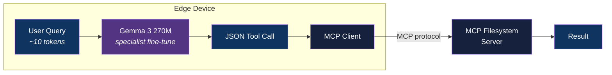

<div align="center">

# Edge MCP Caller

[](https://www.python.org/downloads/)
[](LICENSE)
[](#)

**Specialist 270M model that bakes MCP tool knowledge into weights — beating generalist function callers with 40x shorter prompts on edge devices.**

[Getting Started](#getting-started) | [Architecture](#architecture) | [Benchmark](#benchmark) | [Roadmap](#roadmap)

</div>

---

## The Thesis

Google's FunctionGemma takes Gemma 3 270M and makes it a **generalist** function caller — pass any tool schema in the prompt (~400 tokens), and it routes to the right tool. It achieves 85% accuracy after fine-tuning.

We take the **same base model** and make it a **specialist** — tool definitions baked directly into model weights. No schemas in the prompt. Query in (~10 tokens), JSON tool call out.

> A 270M model has no business being a generalist. Make it a specialist, deploy it on the edge, and let it do one job perfectly.

## Features

- **Specialist fine-tune** — tool knowledge baked into weights, not passed in prompts
- **40x shorter prompts** — ~10 tokens vs ~420 tokens per call
- **Edge-ready** — 301 MB, runs on phones, laptops, Raspberry Pi, <100ms latency
- **MCP-native** — calls real MCP servers via standard protocol
- **Head-to-head benchmark** — provable comparison against FunctionGemma and GPT-4
- **Zero API cost** — fully local inference, no cloud dependency

## Tech Stack

| Component | Technology |
|-----------|------------|
| Base Model | Gemma 3 270M (`google/gemma-3-270m-pt`) |
| Fine-tuning | Unsloth (LoRA/QLoRA) |
| Training Data | Synthetic via Claude API |
| Inference | Ollama / llama.cpp |
| MCP Server | @modelcontextprotocol/server-filesystem |
| Language | Python 3.12+ |

## Architecture



### Generalist vs Specialist

```
FunctionGemma (generalist):
  Input:  [~400 tokens of schemas] + [query]  = ~420 tokens
  Model:  270M params split between parsing schemas + routing intent
  Output: <start_function_call>call:tool{args}<end_function_call>

Ours (specialist):
  Input:  [query only]  = ~10 tokens
  Model:  270M params fully focused on routing intent for known tools
  Output: {"tool": "list_directory", "args": {"path": "src/"}}
```

## Getting Started

### Prerequisites

- Python 3.12+
- NVIDIA GPU with 8GB+ VRAM (for training) or free Google Colab
- Ollama (for inference)
- Node.js 18+ (for MCP filesystem server)

### Installation

1. Clone the repository:
   ```bash
   git clone https://github.com/adityonugrohoid/edge-mcp-caller.git
   cd edge-mcp-caller
   ```

2. Create and activate a virtual environment:
   ```bash
   python -m venv .venv
   source .venv/bin/activate
   ```

3. Install dependencies:
   ```bash
   pip install -r requirements.txt
   ```

### Configuration

```bash
cp .env.example .env
```

## Usage

```bash
# Step 1: Generate training data
python data/generate_dataset.py

# Step 2: Fine-tune (LoRA)
python train/finetune.py

# Step 3: Merge + convert to GGUF
python train/merge_and_convert.py

# Step 4: Benchmark against FunctionGemma
python eval/benchmark.py

# Step 5: Interactive demo
python demo/cli.py
```

## Benchmark

<!-- TODO: Fill with actual results after v0.1 training -->

| Model | Tool Acc | Arg Acc | Prompt Tokens | Latency |
|-------|----------|---------|---------------|---------|
| Gemma 3 270M (raw) | ~10% | ~5% | 10 | <50ms |
| FunctionGemma (base) | ~58% | ~40% | 420 | ~200ms |
| FunctionGemma (fine-tuned) | ~85% | ~70% | 420 | ~200ms |
| **Ours (specialist)** | **TBD** | **TBD** | **10** | **<100ms** |
| GPT-4 (ceiling) | ~95% | ~90% | 420 | ~2000ms |

## Project Structure

```
edge-mcp-caller/
├── data/
│   ├── generate_dataset.py       # Synthetic data gen via Claude API
│   ├── train.jsonl                # Fine-tuning dataset
│   └── eval.jsonl                 # Held-out eval set
├── tools/
│   └── filesystem.json            # MCP tool definitions (reference)
├── train/
│   ├── finetune.py                # LoRA fine-tune via Unsloth
│   └── merge_and_convert.py       # Merge adapter + GGUF conversion
├── eval/
│   ├── benchmark.py               # Run all models on eval set
│   └── compare_functiongemma.py   # Head-to-head comparison
├── mcp/
│   └── client.py                  # JSON → MCP tools/call bridge
├── demo/
│   └── cli.py                     # Interactive CLI demo
├── docs/
│   └── training-lessons.md        # Training troubleshooting guide
├── models/                        # Adapters + GGUF (gitignored)
└── results/
    ├── benchmark.json             # Raw benchmark numbers
    └── report.html                # Visual comparison report
```

## Roadmap

- [ ] **v0.1** — 3 read-only filesystem tools, specialist fine-tune, beat FunctionGemma
- [ ] **v0.2** — + write operations (5 tools)
- [ ] **v0.3** — + multi-argument tools (edit_file)
- [ ] **v0.4** — + second MCP server (multi-server routing)
- [ ] **v0.5** — multi-step agentic chains
- [ ] **v1.0** — packaged edge MCP tool caller

See [ROADMAP.md](ROADMAP.md) for details.

## License

This project is licensed under the [MIT License](LICENSE).

## Author

**Adityo Nugroho** ([@adityonugrohoid](https://github.com/adityonugrohoid))

## Acknowledgments

- [Google Gemma 3](https://ai.google.dev/gemma) — base model
- [FunctionGemma](https://ai.google.dev/gemma/docs/functiongemma) — generalist benchmark target
- [Model Context Protocol](https://modelcontextprotocol.io/) — tool calling standard
- [Unsloth](https://unsloth.ai/) — efficient fine-tuning
- [Amazon SLM Tool Calling Paper](https://arxiv.org/abs/2512.15943) — proving tiny models can compete
- [Microsoft SLM Fine-tuning Guide](https://github.com/microsoft/slm-finetuning-for-function-calling) — baking tools into weights
