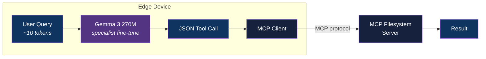

<div align="center">

# Edge MCP Caller

[](https://www.python.org/downloads/)
[](LICENSE)
[](#)

**Specialist 270M model that bakes MCP tool knowledge into weights — beating generalist function callers with 40x shorter prompts on edge devices.**

[Getting Started](#getting-started) | [Architecture](#architecture) | [Benchmark](#benchmark) | [Roadmap](#roadmap)

</div>

---

## The Thesis

Google's FunctionGemma takes Gemma 3 270M and makes it a **generalist** function caller — pass any tool schema in the prompt (~264 tokens), and it routes to the right tool.

We take the **same base model** and make it a **specialist** — tool definitions baked directly into model weights. No schemas in the prompt. Query in (~10 tokens), JSON tool call out.

> A 270M model has no business being a generalist. Make it a specialist, deploy it on the edge, and let it do one job perfectly.

## Features

- **Specialist fine-tune** — tool knowledge baked into weights, not passed in prompts
- **13x shorter prompts** — 20 tokens vs 264 tokens per call
- **Edge-ready** — 291 MB, runs on phones, laptops, Raspberry Pi, 142ms avg latency
- **MCP-native** — calls real MCP servers via standard protocol
- **Head-to-head benchmark** — provable comparison against FunctionGemma, GPT-OSS-120B, and raw Gemma
- **Zero API cost** — fully local inference, no cloud dependency

## Tech Stack

| Component | Technology |
|-----------|------------|
| Base Model | Gemma 3 270M (`google/gemma-3-270m-pt`) |
| Fine-tuning | Unsloth (LoRA/QLoRA) |
| Training Data | Synthetic via NVIDIA NIM API (llama-3.1-70b-instruct) |
| Inference | Ollama / llama.cpp |
| MCP Server | @modelcontextprotocol/server-filesystem |
| Language | Python 3.12+ |

## Architecture



### Generalist vs Specialist

```
FunctionGemma (generalist):
  Input:  [~250 tokens of schemas] + [query]  = ~264 tokens
  Model:  270M params split between parsing schemas + routing intent
  Output: <start_function_call>call:tool{args}<end_function_call>

Ours (specialist):
  Input:  [query only]  = ~20 tokens
  Model:  270M params fully focused on routing intent for known tools
  Output: {"tool": "list_directory", "args": {"path": "src/"}}
```

## Getting Started

### Prerequisites

- Python 3.12+
- NVIDIA GPU with 8GB+ VRAM (for training) or free Google Colab
- Ollama (for inference)
- Node.js 18+ (for MCP filesystem server)

### Installation

1. Clone the repository:
   ```bash
   git clone https://github.com/adityonugrohoid/edge-mcp-caller.git
   cd edge-mcp-caller
   ```

2. Create and activate a virtual environment:
   ```bash
   python -m venv .venv
   source .venv/bin/activate
   ```

3. Install dependencies:
   ```bash
   pip install -r requirements.txt
   ```

### Configuration

```bash
cp .env.example .env
```

## Usage

```bash
# Step 1: Generate training data
python data/generate_dataset.py

# Step 2: Fine-tune (LoRA)
python train/finetune.py

# Step 3: Merge + convert to GGUF
python train/merge_and_convert.py

# Step 4: Benchmark against FunctionGemma
python eval/benchmark.py

# Step 5: Interactive demo
python demo/cli.py                  # interactive mode
python demo/cli.py -n 10            # batch: 10 eval examples through MCP
python demo/cli.py -n 360           # batch: full eval set through MCP
python demo/cli.py -n 5 --verbose   # batch with per-query pipeline detail
```

## Benchmark

360 eval examples, deterministic (temp=0), each model tested in its native interface. See [`docs/benchmark-methodology.md`](docs/benchmark-methodology.md) for full methodology and fairness analysis.

| Model | Tool Acc | Args Acc | Combined | Avg Prompt Tokens | Avg Latency |
|-------|----------|----------|----------|-------------------|-------------|
| **Ours (specialist, 270M)** | **99.2%** | **90.8%** | **90.8%** | **20** | **142ms** |
| GPT-OSS 120B (NIM API, ceiling) | 76.4% | 23.6% | 23.3% | 246 | 817ms |
| FunctionGemma 270M (Ollama tools API) | 38.1% | 20.3% | 18.1% | 264 | 146ms |
| Raw Gemma 3 270M (few-shot prompt) | 42.2% | 25.3% | 13.3% | 269 | 452ms |

### Per-Tool Breakdown (specialist)

| Tool | Count | Tool Acc | Args Acc | Combined |
|------|-------|----------|----------|----------|
| list_directory | 104 | 99.0% | 93.3% | 93.3% |
| read_file | 125 | 99.2% | 96.0% | 96.0% |
| search_files | 131 | 99.2% | 84.0% | 84.0% |

### Prompt Efficiency

- **Specialist**: 20 tokens/request (tools baked into weights)
- **GPT-OSS 120B**: 246 tokens/request (12x more)
- **FunctionGemma**: 264 tokens/request (13x more)
- **Raw Gemma 3**: 269 tokens/request (14x more)

Full results: [`results/benchmark.json`](results/benchmark.json) | [`results/report.html`](results/report.html) | [`docs/benchmark-methodology.md`](docs/benchmark-methodology.md)

## Live Demo — End-to-End Pipeline

Every query goes through the full pipeline: user query → Ollama specialist → JSON parse → MCP `tools/call` → real filesystem result. The CLI shows each step with metrics.

### Single Query (verbose)

```
> find all Python files in eval/

┌─────────────────────────── 1. Ollama Request ────────────────────────────┐
│ {                                                                        │
│   "model": "edge-mcp-caller:latest",                                     │
│   "messages": [{"role": "user", "content": "find all Python files ..."}] │
│ }                                                                        │
└──────────────── POST http://localhost:11434/api/chat ────────────────────┘
┌─────────────────────────── 2. Model Response ────────────────────────────┐
│ Raw output:  {"tool":"search_files","args":{"path":"eval/","pattern":..} │
│ Parsed tool: search_files                                                │
│ Parsed args: {"path": "eval/", "pattern": "*.py"}                        │
└──────────────────────────────────────────────────────────────────────────┘
  Prompt tokens: 16 | Output tokens: 20 | Schema tokens: 0 (baked in)
  Inference latency: 142ms

┌─────────────────────────── 3. MCP Request ───────────────────────────────┐
│ {"method": "tools/call",                                                 │
│  "params": {"name": "search_files",                                      │
│             "arguments": {"path": "eval/", "pattern": "*.py"}}}          │
└──────────── stdio → @modelcontextprotocol/server-filesystem ─────────────┘
┌─────────────────────────── 4. MCP Response ──────────────────────────────┐
│ /home/user/projects/edge-mcp-caller/eval/benchmark.py                    │
└──────────────────────────────────────────────────────────────────────────┘
  MCP latency: 6ms | Total end-to-end: 149ms
```

### Full Eval Set — 360 Queries Through MCP

`python demo/cli.py -n 360` — runs all 360 eval examples through the live MCP pipeline:

| Metric | Value |
|--------|-------|
| Tool accuracy | **99.2%** (357/360) |
| Args accuracy | **90.8%** (327/360) |
| Combined accuracy | **90.8%** (327/360) |
| MCP execution success | **100.0%** (360/360) |
| Avg prompt tokens | 20 |
| Avg model latency | 151ms |
| Avg MCP latency | 111ms |
| Avg total e2e latency | 263ms |
| Throughput | 2.8 queries/sec |

**0 MCP errors across 360 calls** — the model always produces valid, parseable JSON. Even when args are wrong (33 cases: trailing slashes, pattern formatting), the pipeline handles it gracefully without crashes.

### Per-Tool MCP Pipeline Breakdown

| Tool | Count | Tool Acc | Args Acc | Combined | MCP OK |
|------|-------|----------|----------|----------|--------|
| list_directory | 104 | 99.0% | 93.3% | 93.3% | 100.0% |
| read_file | 125 | 99.2% | 96.0% | 96.0% | 100.0% |
| search_files | 131 | 99.2% | 84.0% | 84.0% | 100.0% |

## Project Structure

```
edge-mcp-caller/
├── data/
│   ├── generate_dataset.py       # Synthetic data gen via NVIDIA NIM API
│   ├── train.jsonl                # Fine-tuning dataset
│   └── eval.jsonl                 # Held-out eval set
├── tools/
│   └── filesystem.json            # MCP tool definitions (reference)
├── train/
│   ├── finetune.py                # LoRA fine-tune via Unsloth
│   └── merge_and_convert.py       # Merge adapter + GGUF conversion
├── eval/
│   ├── benchmark.py               # Run all models on eval set
│   └── compare_functiongemma.py   # Head-to-head comparison
├── mcp/
│   └── client.py                  # JSON → MCP tools/call bridge
├── demo/
│   └── cli.py                     # Interactive CLI demo
├── docs/
│   ├── training-lessons.md        # Training troubleshooting guide
│   └── benchmark-methodology.md   # Benchmark fairness & methodology
├── models/                        # Adapters + GGUF (gitignored)
└── results/
    ├── benchmark.json             # Raw benchmark numbers
    ├── cli_batch.json             # Full 360-query MCP pipeline results
    └── report.html                # Visual comparison report
```

## Roadmap

- [x] **v0.1** — 3 read-only filesystem tools, specialist fine-tune, beat FunctionGemma
- [ ] **v0.2** — + write operations (5 tools)
- [ ] **v0.3** — + multi-argument tools (edit_file)
- [ ] **v0.4** — + second MCP server (multi-server routing)
- [ ] **v0.5** — multi-step agentic chains
- [ ] **v1.0** — packaged edge MCP tool caller

See [ROADMAP.md](ROADMAP.md) for details.

## License

This project is licensed under the [MIT License](LICENSE).

## Author

**Adityo Nugroho** ([@adityonugrohoid](https://github.com/adityonugrohoid))

## Acknowledgments

- [Google Gemma 3](https://ai.google.dev/gemma) — base model
- [FunctionGemma](https://ai.google.dev/gemma/docs/functiongemma) — generalist benchmark target
- [Model Context Protocol](https://modelcontextprotocol.io/) — tool calling standard
- [Unsloth](https://unsloth.ai/) — efficient fine-tuning
- [Amazon SLM Tool Calling Paper](https://arxiv.org/abs/2512.15943) — proving tiny models can compete
- [Microsoft SLM Fine-tuning Guide](https://github.com/microsoft/slm-finetuning-for-function-calling) — baking tools into weights
